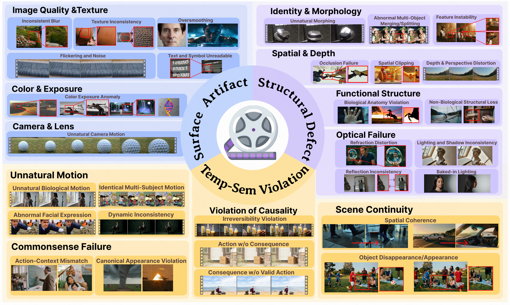
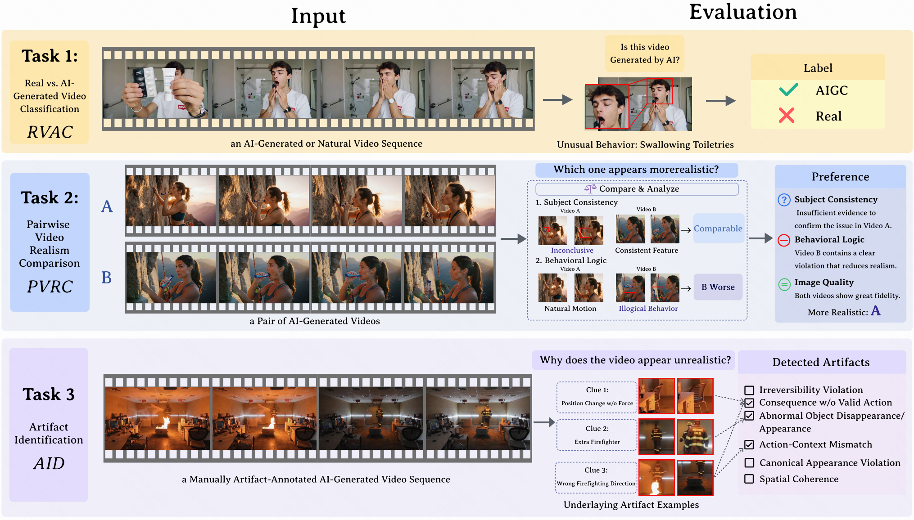
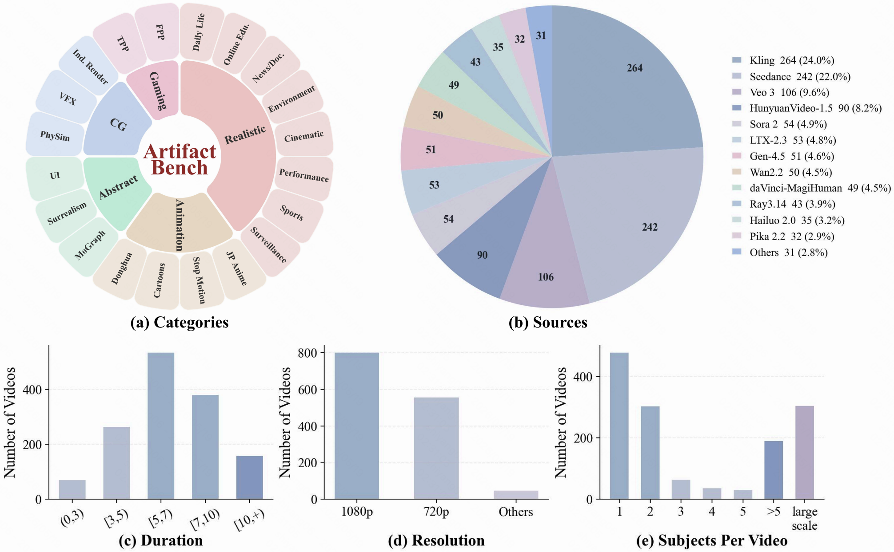
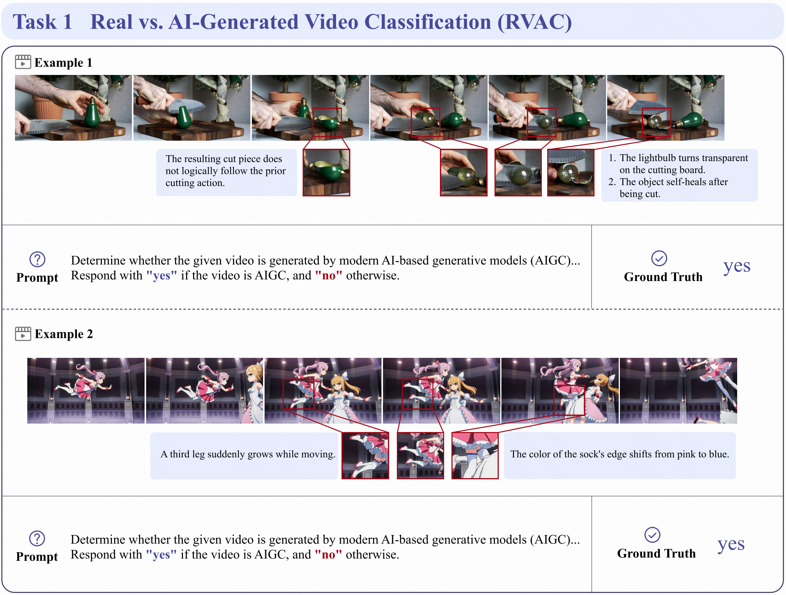
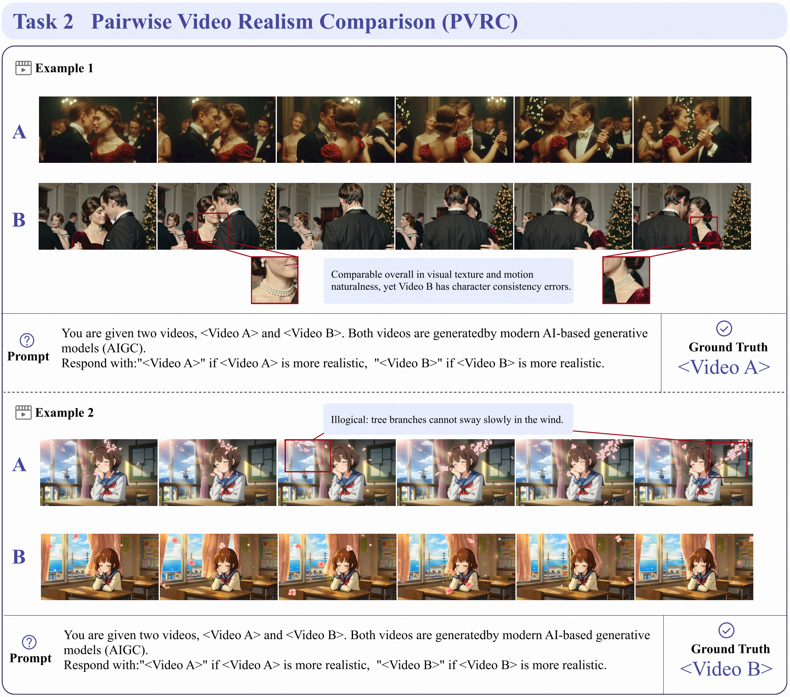
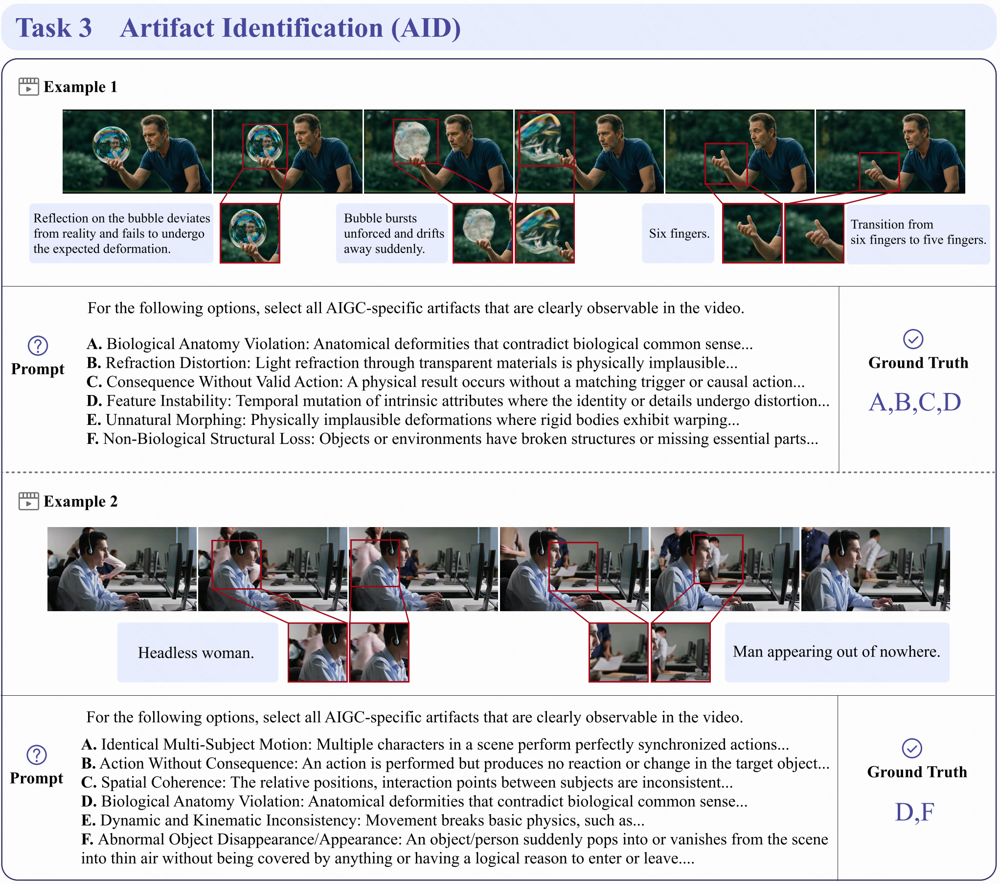

<h1 align="center">
Artifact-Bench: Evaluating MLLMs on Detecting and Assessing the Artifacts of AI-Generated Videos
</h1>

<p align="center">
  <strong>Yuqi Tang</strong><sup>1,2*</sup>,
  <strong>Yang Shi</strong><sup>3,4*†</sup>,
  <strong>Zhuoran Zhang</strong><sup>3*</sup>,
  <strong>Qixun Wang</strong><sup>3*</sup>,
  <strong>Xuehai Bai</strong><sup>5</sup>,
  <strong>Yue Ding</strong><sup>6</sup>
  <strong>Ruizhe Chen</strong><sup>7</sup>,
  <br>
  <strong>Bohan Zeng</strong><sup>3</sup>,
  <strong>Xinlong Chen</strong><sup>6</sup>,
  <strong>Xuanyu Zhu</strong><sup>3</sup>,
  <strong>Bozhou Li</strong><sup>3</sup>,
  <strong>Yuran Wang</strong><sup>3</sup>
  <strong>Yifan Dai</strong><sup>8</sup>,
  <strong>Chengzhuo Tong</strong><sup>3</sup>,
  <br>
  <strong>Xinyu Liu</strong><sup>9</sup>,
  <strong>Yiyan Ji</strong><sup>10</sup>,
  <strong>Yujie Wei</strong><sup>11</sup>,
  <strong>Yuhao Dong</strong><sup>12</sup>,
  <strong>Shilin Yan</strong><sup>11</sup>
  <strong>Fengxiang Wang</strong><sup>13</sup>,
  <br>
  <strong>Yi-Fan Zhang</strong><sup>6‡</sup>,
  <strong>Haotian Wang</strong><sup>14‡</sup>,
  <strong>Yuanxing Zhang</strong><sup>4‡</sup>,
  <strong>Pengfei Wan</strong><sup>4</sup>
</p>
<p align="center">
  <sup>1</sup>HKUST(GZ) &nbsp;&nbsp;
  <sup>2</sup>BUAA &nbsp;&nbsp;
  <sup>3</sup>PKU &nbsp;&nbsp;
  <sup>4</sup>Kling Team &nbsp;&nbsp;
  <sup>5</sup>HDU &nbsp;&nbsp;
  <sup>6</sup>CASIA &nbsp;&nbsp;
  <sup>7</sup>ZJU &nbsp;&nbsp;
  <sup>8</sup>SJTU &nbsp;&nbsp;
  <sup>9</sup>HKUST &nbsp;&nbsp;
  <br>
  <sup>10</sup>NJU &nbsp;&nbsp;
  <sup>11</sup>FDU &nbsp;&nbsp;
  <sup>12</sup>NTU &nbsp;&nbsp;
  <sup>13</sup>Shanghai AI Lab &nbsp;&nbsp;
  <sup>14</sup>THU
</p>
<p align="center">
  <sup>*</sup>Equal Contribution &nbsp;&nbsp;
  <sup>†</sup>Project Lead &nbsp;&nbsp;
  <sup>‡</sup>Corresponding Author
</p>
<p align="center">
  <a href="#">📄 Paper</a> |
  <a href="https://huggingface.co/datasets/DogNeverSleep/Artifact-Bench">🤗 Artifact-Bench Dataset</a>
</p>

## 🔍 Benchmark Overview

- **Artifact Taxonomy**


- **Artifact-Bench Tasks**


- **Statistics of Artifact-Bench**


<details>
<summary><h2>💡 Representive Examples of Each Task</h2></summary>

<details>
<summary>Task 1: Real vs. AI-Generated Video Classification (RVAC)</summary>



</details>

<details>
<summary>Task 2: Pairwise Video Realism Comparison (PVRC)</summary>



</details>

<details>
<summary>Task 3: Artifact Identification (AID)</summary>



</details>

</details>

## ✨ Evaluation Pipeline

This repository provides a lightweight evaluation pipeline for running Qwen3-VL
on Artifact-Bench and post-processing model responses into task-level answers.

### 📍 1. Prepare Input JSONL

We provide the metadata files for all three tasks in [`task/`](task):

- [`task/task1_meta.jsonl`](task/task1_meta.jsonl): Real vs. AI-Generated Video Classification (RVAC)
- [`task/task2_meta.jsonl`](task/task2_meta.jsonl): Pairwise Video Realism Comparison (PVRC)
- [`task/task3_meta.jsonl`](task/task3_meta.jsonl): Artifact Identification (AID)

Each line is one evaluation sample. The released metadata files contain
`task_type`, `sample_id`, `video_path`, `answer`, and `level`; Task 3 also
contains the candidate artifact `option` list.

The `video_path` values are passed directly to the video processor. Please run
the commands from a directory where these paths are valid, keep the downloaded
dataset folders in the released structure, or replace `video_path` with absolute
paths before inference.

### 📍 2. Run Qwen3-VL Inference

Run inference for all three tasks:

```bash
python eval/infer_qwen3_vl.py \
  --model-path Qwen/Qwen3-VL-8B-Instruct \
  --task-dir task \
  --output-dir results \
  --gpu-ids 0 \
  --fps 5
```

Useful options:

- `--gpu-ids 0,1,2,3`: run multi-GPU inference with one worker per GPU.
- `--task-ids 1,2,3`: select which tasks to evaluate.
- `--max-new-tokens 8192`: control the maximum generation length.
- `--model-name qwen3_vl_8b`: store a readable model name in `eval_info`.
- `--attn-implementation sdpa`: use PyTorch SDPA instead of FlashAttention.

The output JSONL keeps the original sample fields and adds:

```json
{"model_response": "yes", "eval_info": {"model": "Qwen3-VL-8B-Instruct", "fps": 5}}
```

If a sample fails, the script records `infer_error` and continues. Re-running
the same command will skip already completed samples in the output file.

### 📍 3. Parse Responses and Compute Accuracy

After inference, normalize model responses into final task answers:

```bash
python eval/result_process.py \
  --input-dir results \
  --output-dir results
```

`result_process.py` applies rule-based answer extraction by default:

- Task 1: `yes` or `no`
- Task 2: `<Video A>` or `<Video B>`
- Task 3: option letters such as `A,C,E`

If the input samples contain `answer`, the script also writes `correct` for
each sample and reports accuracy in the summary JSON.

For long-form model outputs that are difficult to parse by rules, you can use
an OpenAI-compatible parser as a fallback:

```bash
export OPENAI_API_KEY=your_api_key

python eval/result_process.py \
  --input-dir results \
  --output-dir results \
  --parser-model gpt-4o-mini
```

By default, the parser model is only called when rule parsing returns
`Invalid`. Add `--llm-on-all` if you want to parse every sample with the LLM.

## 🔖 Dataset License
**License:**
```
Artifact-Bench is only used for academic research. Commercial use in any form is prohibited.
The copyright of all videos belongs to the video owners.
If there is any infringement in Artifact-Bench, please email frankyang1517@gmail.com and we will remove it immediately.
Without prior approval, you cannot distribute, publish, copy, disseminate, or modify Artifact-Bench in whole or in part. 
You must strictly comply with the above restrictions.
```
Please send an email to <u>frankyang1517@gmail.com</u>. 🌟

## 📚 Citation
```bibtex

```
